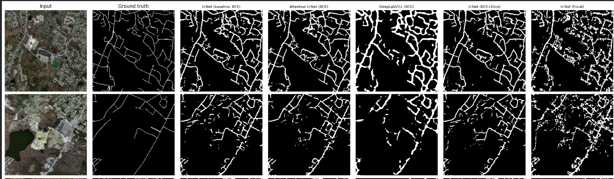

# Road Segmentation from Satellite Imagery

**Semantic segmentation of roads in aerial imagery** using PyTorch — comparing architectures (U-Net, Attention U-Net, DeepLabV3+) and loss functions (BCE, BCE+Dice, Focal Loss) on the Massachusetts Roads Dataset.



---

## Results at a Glance

| Model | IoU | Dice | Precision | Recall | Pixel Acc. |
|---|---|---|---|---|---|
| **U-Net (BCE+Dice)** ✅ | **0.2662** | **0.4165** | 0.2906 | 0.7685 | 0.9094 |
| Attention U-Net (BCE) | 0.2590 | 0.4077 | 0.2881 | 0.7341 | 0.9080 |
| U-Net baseline (BCE) | 0.2565 | 0.4047 | 0.2822 | 0.7489 | 0.9052 |
| U-Net (Focal Loss) | 0.1743 | 0.2921 | 0.2084 | 0.6019 | 0.8732 |
| DeepLabV3+ (BCE) | 0.1657 | 0.2832 | 0.2025 | 0.5445 | 0.8802 |

> **Key finding:** BCE+Dice loss on the plain U-Net outperformed all other configurations. Combining a pixel-wise loss (BCE) with an overlap-based loss (Dice) that is invariant to class frequency proved more impactful than either architectural upgrades or alternative imbalance-handling losses on this dataset.

---

## Project Structure

```
road-segmentation/
├── road_segmentation.ipynb   # End-to-end pipeline (EDA → training → evaluation)
├── assets/                   # Training curves and result plots
│   ├── unet_bce_curves.png
│   ├── attention_unet_curves.png
│   ├── deeplabv3plus_curves.png
│   ├── unet_bcedice_curves.png
│   ├── unet_focal_curves.png
│   ├── val_comparison.png
│   ├── qualitative_predictions.png
│   └── results_table.png
├── report.md                 # Full experimental report
└── README.md
```

The entire pipeline lives in a single notebook, structured as:

| Section | Contents |
|---|---|
| 0. Setup | Dependencies, device config, reproducibility seed |
| 1. Data Exploration | Class imbalance, resolution check, road width distribution, label quality |
| 2. Preprocessing | Resize, normalize (ImageNet stats), augmentation pipeline |
| 3. Dataset & DataLoader | `RoadDataset` class reused across all experiments |
| 4. Evaluation Metrics | IoU, Dice, Precision, Recall, F1, Pixel Accuracy |
| 5. U-Net Baseline (BCE) | 4-level encoder-decoder, from scratch |
| 6. Attention U-Net (BCE) | Additive attention gates on skip connections |
| 7. DeepLabV3+ (BCE) | ASPP + pretrained ResNet34 encoder via `smp` |
| 8. U-Net + BCE+Dice | Loss ablation, architecture held fixed |
| 9. U-Net + Focal Loss | Loss ablation, architecture held fixed |
| 10. Results Analysis | Quantitative table, overlaid training curves, qualitative predictions |
| 11. Conclusion | Summary of findings |

---

## Dataset

**Massachusetts Roads Dataset** — Mnih, V. (2013). *Machine Learning for Aerial Image Labeling* (PhD thesis, University of Toronto).

- **1,171 aerial tiles** of Massachusetts at ~1 m/px resolution (1500×1500 px each)
- Official split: **1108 train / 14 val / 49 test**
- Road masks rasterized from OpenStreetMap centerlines with a fixed line thickness
- ~3–5% road pixels per tile (background:road ≈ 20–35:1)

Download via Kaggle:
```bash
kaggle datasets download -d balraj98/massachusetts-roads-dataset
```

---

## Setup

### Requirements

```bash
pip install torch torchvision albumentations segmentation-models-pytorch opencv-python-headless kagglehub tqdm
```

Tested on Python 3.10, PyTorch 2.x, CUDA 11.8+ (Colab T4/A100).

### Running on Google Colab (recommended)

1. Open `road_segmentation.ipynb` in Colab.
2. Upload your `kaggle.json` API token when prompted in **Cell 2** (or set `KAGGLE_USERNAME` / `KAGGLE_KEY` env vars).
3. Run all cells top-to-bottom — the dataset downloads automatically, all five models train sequentially.
4. **Save outputs to Drive before the session ends** — Colab does not persist `/content/` across sessions:
   ```python
   from google.colab import drive
   drive.mount('/content/drive')
   # then copy your CKPT_DIR to Drive
   ```

> ⚠️ Do not commit `.pt` checkpoint files to Git. Use Google Drive or [Hugging Face Hub](https://huggingface.co/docs/hub/models-uploading) to share model weights.

### Key configuration knobs (Cell 7)

```python
CONFIG = {
    "DATASET_FRACTION": 0.25,  # fraction of train tiles to use (1.0 = all 1108)
    "IMG_SIZE": 256,           # resize all tiles to this resolution
    "BATCH_SIZE": 8,
    "NUM_EPOCHS": 25,
    "LR": 5e-4,
    "PATIENCE": 5,             # early stopping patience
}
```

Reducing `DATASET_FRACTION` is the primary compute lever — at 0.25 (≈277 tiles), all five models train in ~2 hours on a Colab T4.

---

## Models

All models output a single-channel logit map (sigmoid → binary mask at threshold 0.5).

### U-Net (baseline)
Standard 4-level encoder-decoder with skip connections, implemented from scratch. `base=32` channels at the first level doubling at each encoder stage (32 → 64 → 128 → 256).

### Attention U-Net
Same backbone as U-Net, with **additive attention gates** (Oktay et al., 2018) on each skip connection. The gate learns to suppress background-heavy encoder features before concatenation with decoder features — directly addressing the class imbalance problem at the feature level.

### DeepLabV3+
Uses `segmentation-models-pytorch` with a **pretrained ResNet34 encoder** and an **ASPP (Atrous Spatial Pyramid Pooling)** module. ASPP applies parallel dilated convolutions at multiple dilation rates, giving the model a wide multi-scale receptive field suited to road structures that span large spatial extents.

---

## Loss Functions

All BCE variants use a **class-weighted positive weight** (`pos_weight`) derived from the measured background:road ratio, preventing the trivial "predict background everywhere" shortcut.

| Loss | Formula / Behavior |
|---|---|
| **BCE** | Pixel-wise cross-entropy with `pos_weight` to counter class imbalance |
| **BCE + Dice** | 50/50 blend — BCE for stable pixel-level gradients + Dice for overlap-invariant class-balanced supervision |
| **Focal Loss** | `(1 - p_t)^γ · BCE` with γ=2, class-weighted `alpha_t` derived from the measured imbalance |

---

## Training Details

- **Optimizer:** Adam (lr=5e-4), with `ReduceLROnPlateau` (factor=0.5, patience=2 on val IoU)
- **Augmentation (train only):** horizontal/vertical flips, random 90° rotations, mild affine, brightness/contrast jitter, Gaussian noise
- **Normalization:** ImageNet mean/std (required for pretrained ResNet34 encoder; applied uniformly to all models for consistency)
- **Early stopping:** patience=5 on val IoU; best checkpoint (by val IoU) is restored before test evaluation
- **Mixed precision:** `torch.amp.GradScaler` enabled when CUDA is available
- **Gradient clipping:** norm clipped to 1.0

---

## Evaluation

Metrics are computed from shared TP/FP/FN/TN counts (no metric inconsistency):

- **IoU (Jaccard)** — primary metric; directly reflects segmentation overlap
- **Dice / F1** — harmonically related to IoU; more sensitive to small structures
- **Precision / Recall** — tradeoff between false positives and missed roads
- **Pixel Accuracy** — included but misleading under class imbalance (a model predicting all-background scores ~95%)

---

## Limitations & Future Work

- **Scale:** only 25% of training tiles used due to Colab compute constraints. Full-dataset training would likely benefit all models.
- **Resolution:** tiles downsampled to 256×256 from 1500×1500 (≈6× area reduction) — thin roads become 1–2 px wide, making accurate segmentation very hard.
- **Label noise:** OSM-rasterized masks have registration offsets and coverage gaps that impose a ceiling on achievable IoU independent of model quality.
- **Threshold tuning:** a fixed 0.5 threshold used throughout; optimizing per-model could improve precision/recall tradeoffs.
- **Possible improvements:** test-time augmentation (TTA), post-processing (connected-component filtering, morphological cleanup), larger pretrained encoders (ResNet50, EfficientNet), transformer-based segmenters (Segformer, Mask2Former).

---

## References

- Mnih, V. (2013). *Machine Learning for Aerial Image Labeling*. PhD thesis, University of Toronto.
- Ronneberger, O., Fischer, P., & Brox, T. (2015). [U-Net: Convolutional Networks for Biomedical Image Segmentation](https://arxiv.org/abs/1505.04597). MICCAI.
- Oktay, O. et al. (2018). [Attention U-Net: Learning Where to Look for the Pancreas](https://arxiv.org/abs/1804.03999). MIDL.
- Chen, L.-C. et al. (2018). [Encoder-Decoder with Atrous Separable Convolution for Semantic Image Segmentation (DeepLabV3+)](https://arxiv.org/abs/1802.02611). ECCV.
- Lin, T.-Y. et al. (2017). [Focal Loss for Dense Object Detection](https://arxiv.org/abs/1708.02002). ICCV.
- Milletari, F., Navab, N., & Ahmadi, S.-A. (2016). [V-Net: Fully Convolutional Neural Networks for Volumetric Medical Image Segmentation](https://arxiv.org/abs/1606.04797) (Dice Loss).

---

## License

MIT
